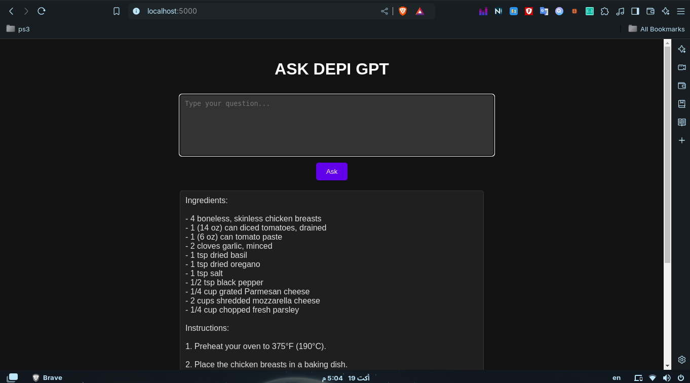

# 🧠 ChatGPT Integration via RapidAPI - Flask App 🚀

Welcome to the **ChatGPT Integration Project**! This project demonstrates how to create an interactive AI-powered chatbot using **Flask**, **RapidAPI**, and **ChatGPT**. The application is Dockerized and deployed seamlessly to a server using **Ansible** for configuration and automation.

## 🌟 Features

- **AI Chatbot** powered by OpenAI's ChatGPT via RapidAPI.
- **Modern Architecture**: Flask web framework for building scalable APIs.
- **Containerization**: Fully Dockerized for easy deployment and portability.
- **Automation**: Ansible scripts used to configure and deploy the app to a server.
- **Creative UI**: Clean, responsive, and modern frontend design with dark mode.

## 🛠️ Tech Stack

- **Flask**: Backend framework for Python web apps.
- **RapidAPI**: Integration with OpenAI’s ChatGPT for natural language processing.
- **Docker**: Containerization to ensure consistent environments across platforms.
- **Ansible**: Configuration management and deployment automation.
- **Nginx**: Reverse proxy for handling web traffic and managing requests.
- **Gunicorn**: Python WSGI HTTP Server to serve the app in production.
- **Jenkins**: Continuous integration and deployment with Slack notifications.


## 🏗️ Project Structure

```
.
├── ansible/              # Ansible playbooks for server config and deployment
        ├── hosts.ini     # Server Host
        ├── playbook.yml  # Playbook.yml
├── jenkins/              # Jenkins pipeline
        ├── jenkinss      # Pipeline script  
├── static                # Frontend Folder 
        ├── styles.css    # css, js
├── templates             # HTML templates
        ├── test
├── test                  # Test app folder
    ├── test.py
├── Dockerfile            # Docker instructions
├── requirements.txt      # Python dependencies
├── README.md             # Project documentation
└── app.py                # Entry point to start the Flask app

```

## 🚀 Quick Start

### 1. Clone the repository

```bash
git https://github.com/andrewbassily0/DEPI-ASK
cd  DEPI-ASK
```

### 2. Set up environment variables

Create a `.env` file and add your API key from RapidAPI:

```bash
RAPIDAPI_KEY=your_rapidapi_key
```

### 3. Build and run the Docker container

```bash
docker build -t DEPI-ASK .
docker run -p 5000:5000 DEPI-ASK
```

### 4. Deploy using Ansible

Ensure you have Ansible installed and set up your server configuration:

```bash
ansible-playbook -i hosts playbook.yml
```

## 🌐 API Endpoints

- `GET /` - Home page with the chatbot UI.
- `POST /chat` - Endpoint for sending messages to ChatGPT via RapidAPI.

## 🐳 Docker Setup

To build and run the app in a Docker container:

```bash
docker build -t DEPI-ASK
```

## ⚙️ Ansible Deployment

Use the Ansible playbooks provided in the `ansible/` directory to automate server configuration and app deployment.

```bash
ansible-playbook -i hosts playbook.yml
```

## 🤖 ChatGPT Integration

This application leverages **ChatGPT** through **RapidAPI** for intelligent responses based on user input. Check out the RapidAPI integration in the `views.py` file to see how the chatbot connects and processes messages.

## 🖼️ Screenshots

| Home Page | Chat Interface |
| --------- | --------------- |
|  |  |

## 👨‍💻 Contributing

Contributions are welcome! Feel free to submit pull requests or open issues to improve the project.

## 📝 License

This project is licensed under the MIT License.

---

This `README.md` covers your project's purpose, features, and instructions while maintaining a professional and creative touch. Let me know if you need any adjustments!